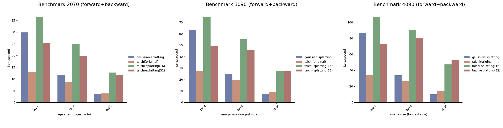
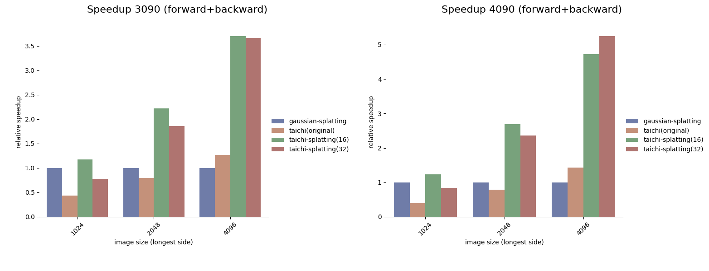
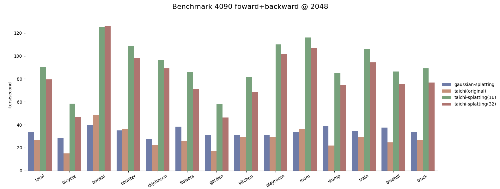

# Benchmarks

## Summary

Charts showing overall averages across benchmark scenes. (details below!)

## Method

### Implementations shown

* gaussian-splatting - original (cuda) implementation for gaussian-splatting paper [diff_gaussian_rasterizer](https://github.com/graphdeco-inria/diff-gaussian-rasterization) 
* taichi(original) - original taichi implementation [taichi_3d_gaussian_splatting](https://github.com/wanmeihuali/taichi_3d_gaussian_splatting) 
* taichi-splatting(16) - our implementation with tile_size=16
* taichi-splatting(32) - our implementation with tile_size=32

### Assets required

The benchmark uses reconstructions from the official gaussian-splatting implementation. These can be found from the official [gaussian-splatting](https://github.com/graphdeco-inria/gaussian-splatting) page. Under [Pre-trained models](https://repo-sam.inria.fr/fungraph/3d-gaussian-splatting/datasets/pretrained/models.zip).

Though it can also be run on any other reconstructions, this is a good common benchmark.

### Running

The script for running these benchmarks is found in the [splat-viewer](https://github.com/uc-vision/splat-viewer/blob/main/splat_viewer/scripts/splat_multi_benchmark.py) repository as the `splat-multi-benchmark` script, such to not polute the repository here with other dependencies. 

It was run with arguments `splat-multi-benchmark *(/)`  when in the `models` folder.

### Benchmark protocols

* All methods first convert splat data to the most convenient form as not perform conversions during benchmark:
    * Alpha, scale etc. activations are computed for diff_gaussian_rasterization 
    * Gaussian parameters are packed for taichi-splatting

* Camera views for each of the original viewpoints are renderered in succession
* Camera image sizes use a longest-edge resizing (the original images vary in size quite a bit) and the shortest edge is scaled in proportion
   * taichi_3d_gaussian_splatting images are padded to the tile size (usually 16)

* Torch synchronization is called at the end of each benchmark   

Averages are computed using a geometric mean across all the scenes (note that the 2070 average excludes a couple of results which were Out of Memory due to the lower 8Gb VRAM).

## Results

### Raw data

Benchmark is run on three different machines with different performance GPUs, Nvidia 2070,3090, and 4090 and at three different resolution levels, with longest size resized to 1024, 2048 and 4096. Three different implementations are tested, the original taichi_3d_gaussian_splatting `taichi(original)`, the taichi-splatting at two different tile sizes `taichi-splatting(16)` and `taichi-splatting(32)` and the official implementation diff_gaussian_rasterization, labelled `gaussian-splatting`.

Raw data: [2070](benchmarks/raw/benchmark-2070.csv), [3090](benchmarks/raw/benchmark-3090.csv), [4090](benchmarks/raw/benchmark-4090.csv), Tidied up: [2070](benchmarks/benchmark-2070.csv), [3090](benchmarks/benchmark-3090.csv), [4090](benchmarks/benchmark-4090.csv)

### Discussion

Overall, taichi-splatting has a small speed-up at the lowest image setting, with much larger factors of improvement at higher resolution levels. The original reference implementation likely has less overhead in terms of allocation, and per-point processing. The 4090 in particular shows larger speedups, especially at high resolution, compared to the 

### Invididual benchmarks

A chart showing the performance on one of the individual benchmarks, and the variation across scenes:

### Profiling

Some example profiles showing current relative costs in different parts of the rendering system can be seen for the [bicycle](profiles/bicycle_2048.txt) scene on a 4090 GPU, where the backward kernel is still the largest cost, but at a much reduced level compared to the taichi_3d_gaussian_splatting implementation which was the starting point (where it was 85-90% of the time spent).
